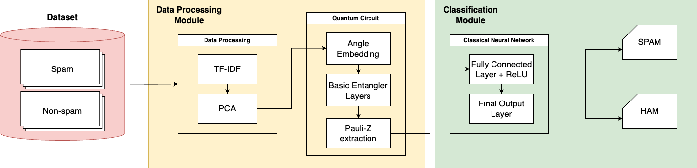

# Hybrid Quantum-Classical Neural Network for Spam Email Detection

## Overview
We are excited to present a project that leverages quantum computing and machine learning to detect spam email effectively.




## Installation & Usage

To get started with this project, clone the repository and install the required dependencies:

```bash
git clone https://github.com/zhangl64/qnn-spam-detect.git
```
```
cd qnn-spam-detect
```

Run the model using the following command:
```
python main.py
```


## Citation
If you use this project or its findings, please cite it as follows:

```

```

## Contact
For any inquiries, please reach out via email at ainazj1@umbc.edu.
